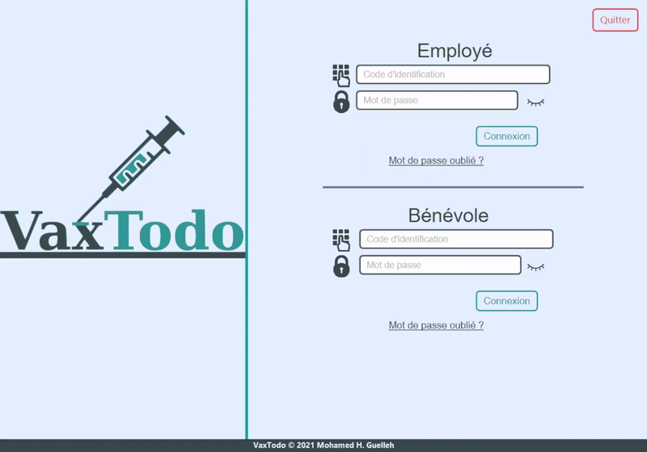
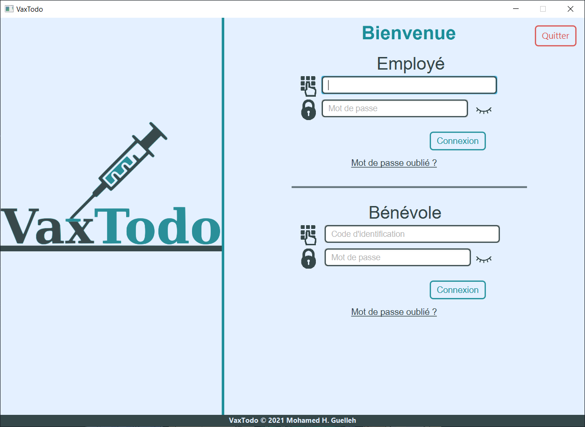
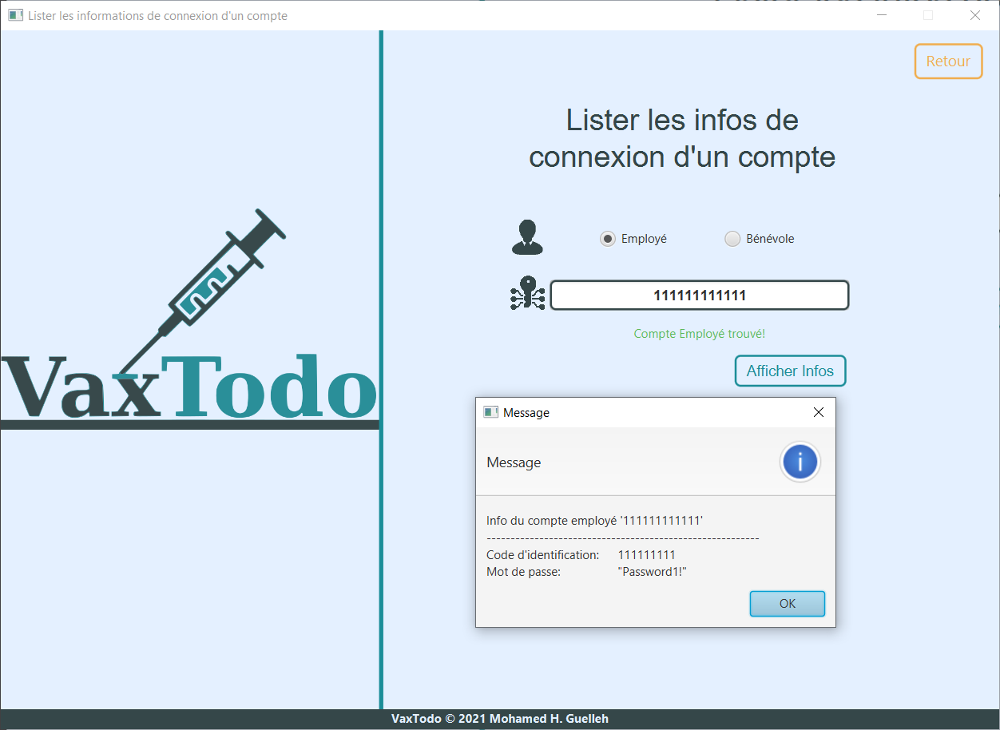
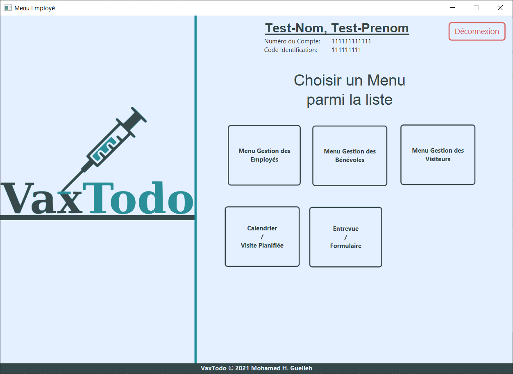
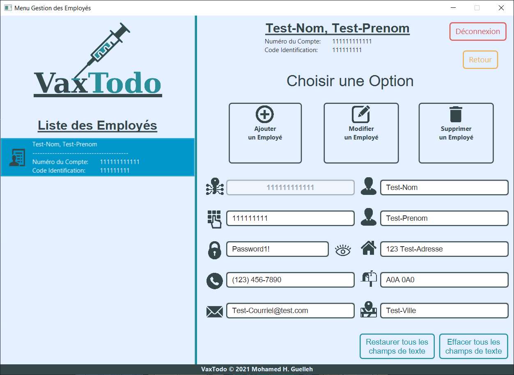
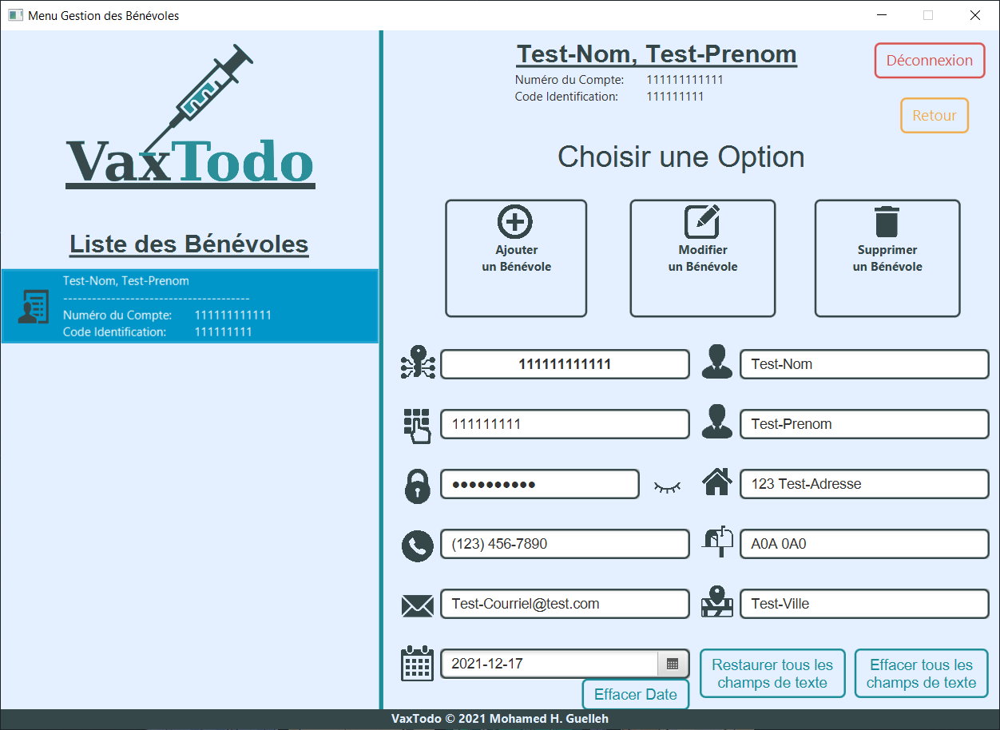
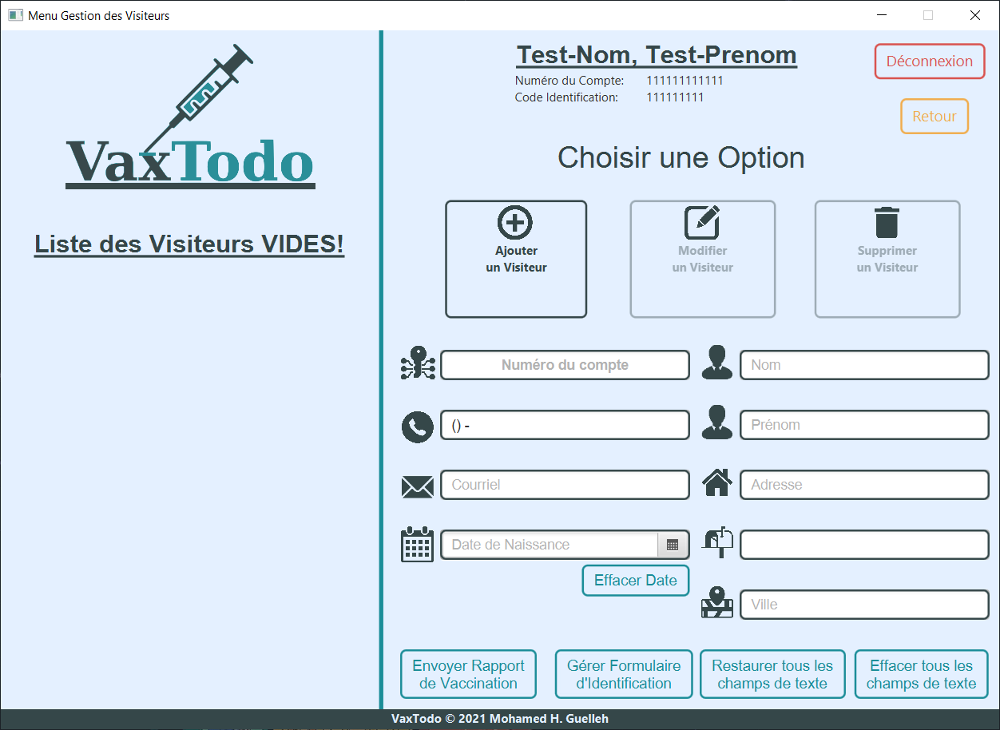
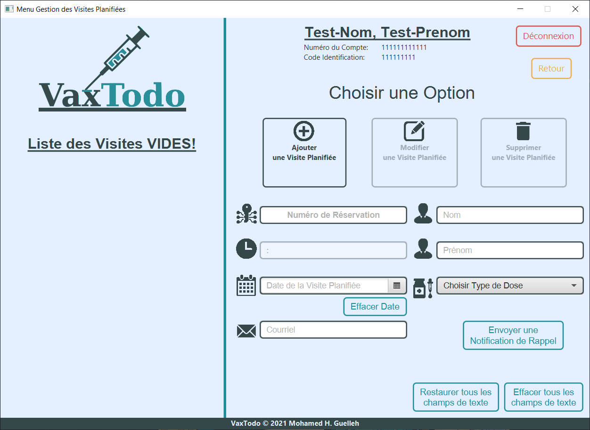
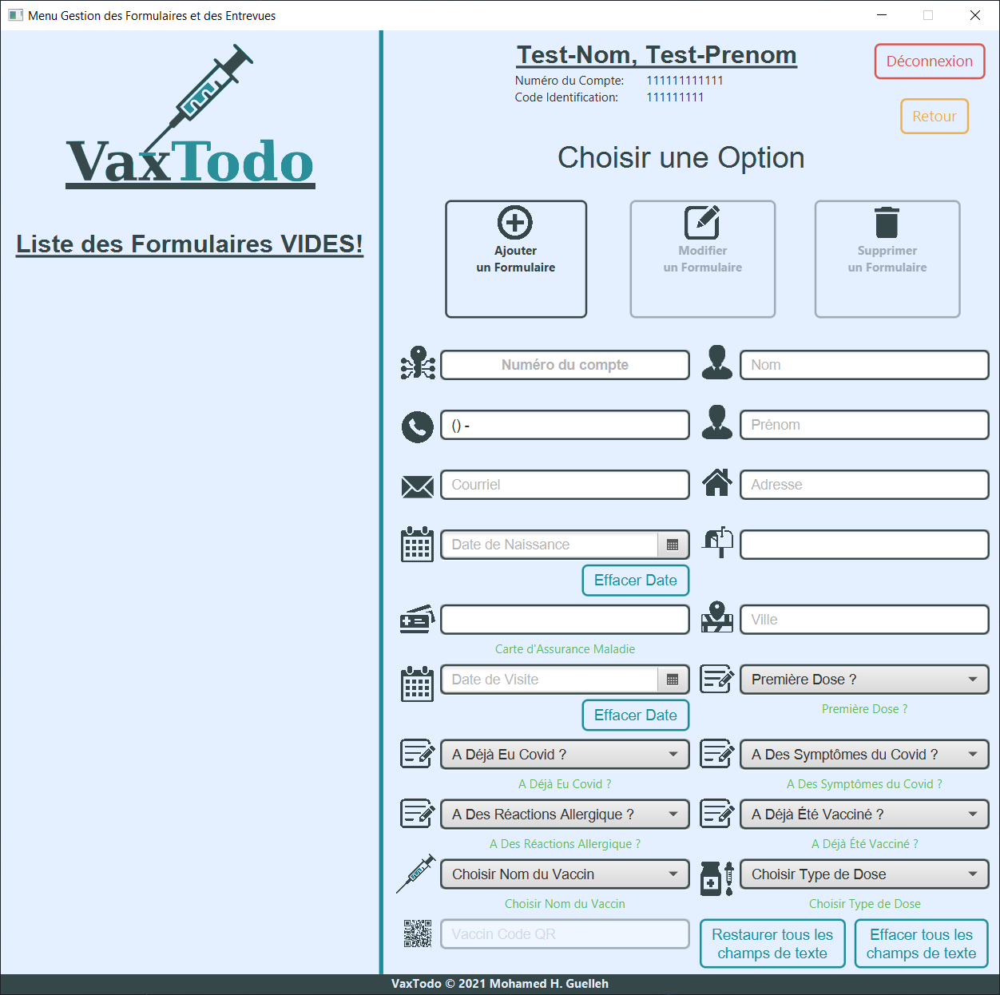
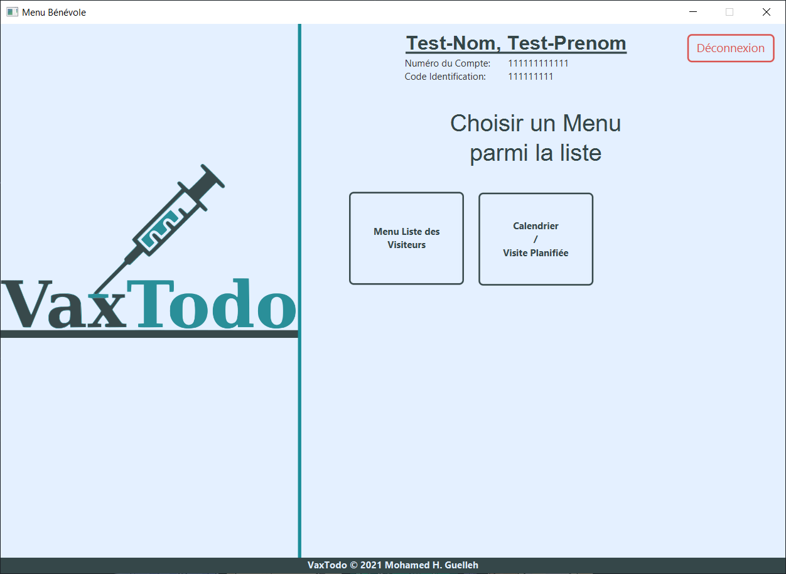

# Projet VaxTodo du cours IFT2255

Cette application est un prototype de VaxTodo permettant de faire de la plannification de rendez-vous de vaccination.
Elle gère les comptes de employés, des bénévoles, ainsi que des visiteurs.
Il s'agit d'une application graphique, il est donc très facile de s'y reperer et l'application est très intuitive.

## Fonctionnalités

- Réserver une période de vaccination.
- Gérer les comptes des visiteurs, bénévoles et employés.
- Gérer les rendez-vous
- Ajouter des informations importantes en lien au vaccin dans le compte du visiteur et de faire un suivi qui lui sera utile.

## Quelques spécifications

- L'application comporte plusieurs validations (validation à l'entrée, validation de lecture et d'écriture sur les fichiers).
- Encryption des mots de passse et des fichiers avec un algorithme de grade militaire.
- Code isolé et utilisation de l'héritage et de l'abstraction
- les classes modèles ont des ReturnClass pour retourner plus qu'une valeur

## Manuel d'utilisation

Pour utiliser l'application (windows), vous aller devoir mettre dans un meme dossier à vous même, le dossier "jdk-17.0.1-Windows", 
le log properties "logging.properties" ainsi que le Vaxtodo.exe qui se situent dans  "/Prototype/VaxTodo/out/artifacts/VaxTodo_jar/Windows/".
Ensuite, à partir de ce dossier, lancer "VaxTodo.exe".
Étant un prototype, nous avons inclus un jeu de données afin de tester l'application.
À l'ouverture, vous devez vous connecter en tant qu'employé ou bénévole. Ceci vous donnera accès
au menu principal propre au rôle. Pour tester l'application, il est possible de tout faire une fois connecté. L'employé à évidemment plus de droit que le bénévole.

### Données incluses dans l'application

- Employé
    - Numéro de compte:&emsp;&ensp;111111111111
    - Code d'identification:&emsp;111111111
    - Mot de passe: &emsp;&emsp;&emsp;&emsp;Password1!
    - Numéro de téléphone:&ensp;1234567890
    - Nom:&emsp;&emsp;&emsp;&emsp;&emsp;&emsp;&emsp;&emsp;Test-Nom
    - Prénom: &emsp;&emsp;&emsp;&emsp;&emsp;&emsp;&ensp;Test-Prenom
    - Adresse: &emsp;&emsp;&emsp;&emsp;&emsp;&emsp;&ensp;123 Test-Adresse
    - Code Postal: &emsp;&emsp;&emsp;&emsp;&emsp;A0A0A0
    - Ville:&emsp;&emsp;&emsp;&emsp;&emsp;&emsp;&emsp;&emsp;&ensp;Test-Ville
    - Courriel:&emsp;&emsp;&emsp;&emsp;&emsp;&emsp;&emsp;Test-Courriel@test.com
  
- Bénévole
    - Numéro de compte:&emsp;&ensp;111111111111
    - Code d'identification:&emsp;111111111
    - Mot de passe: &emsp;&emsp;&emsp;&emsp;Password1!
    - Numéro de téléphone:&ensp;1234567890
    - Nom:&emsp;&emsp;&emsp;&emsp;&emsp;&emsp;&emsp;&emsp;Test-Nom
    - Prénom: &emsp;&emsp;&emsp;&emsp;&emsp;&emsp;&ensp;Test-Prenom
    - Adresse: &emsp;&emsp;&emsp;&emsp;&emsp;&emsp;&ensp;123 Test-Adresse
    - Code Postal: &emsp;&emsp;&emsp;&emsp;&emsp;A0A0A0
    - Ville:&emsp;&emsp;&emsp;&emsp;&emsp;&emsp;&emsp;&emsp;&ensp;Test-Ville
    - Courriel:&emsp;&emsp;&emsp;&emsp;&emsp;&emsp;&emsp;Test-Courriel@test.com
    - Date de Naissance: &emsp;&emsp;1990-01-01

### Menu Connexion

Pour se connecter à l'application, veuillez utiliser un des identifiants suivants:

- Connexion Employé
    - Code d'identification:&emsp;111111111
    - Mot de passe: &emsp;&emsp;&emsp;&emsp;Password1!
  
- Connexion Bénévole
    - Code d'identification:&emsp;111111111
    - Mot de passe: &emsp;&emsp;&emsp;&emsp;Password1!

  

### Menu Mot de passe Oublié

### Menu Employé

À partir du menu employé, dans le rôle de l'employé, vous pouvez cliquer sur l'option de votre choix.
En tout tant vous pouvez cliquer sur le bouton "retour" pour revenir en arrière ou le bouton "déconnexion" pour revenir à l'écran de connexion.

- Gestion des visiteurs: Accédez à la liste des visiteurs et ajouter, modifier ou supprimer un visiteur.
- Entrevue / Formulaire : Accédez à la listes de tous les formulaire des visiteurs. Il est possible d'en ajouter, d'en modifier et d'en supprimer. Les formulaires posent des questions essentielles pour chaque visiteur.
- Consultation des visites planifiées : Accédez à la liste des visites plannifiées, possibilité d'ajouter, modifier ou supprimer une visite. Il est aussi possible d'envoyer une notification de rappel.
- Gestion des employés : Accédez à la liste des employés et ajouter, modifier ou supprimer un employé.
- Gestion des bénévoles : Accédez à la liste des bénévoles et ajouter, modifier ou supprimer un bénévole.

### Menu Gestion des Employés

  

### Menu Gestion des Bénévole

  

### Menu Gestion des Visiteurs

  

### Menu Gestion des Visites Planifiées

  

### Menu Gestion des Formulaires

  

### Menu Bénévole

À partir du menu bénévole, dans le rôle du bénévole, vous pouvez cliquer sur l'option de votre choix.
En tout tant vous pouvez cliquer sur le bouton "retour" pour revenir en arrière ou le bouton "déconnexion" pour revenir à l'écran de connexion.

- Menu liste des visiteurs : Chercher et voir les informations d'un visiteur. Il est impossible d'apporter des modifications à cette liste.
- Consultation de la liste des visites : Accédez à la liste des visites plannifiées, possibilité d'ajouter, modifier ou supprimer une visite. Il est aussi possible d'envoyer une notification de rappel.

Aucune gestion d'employés, de bénévoles est possible avec les droits d'un bénévole.

